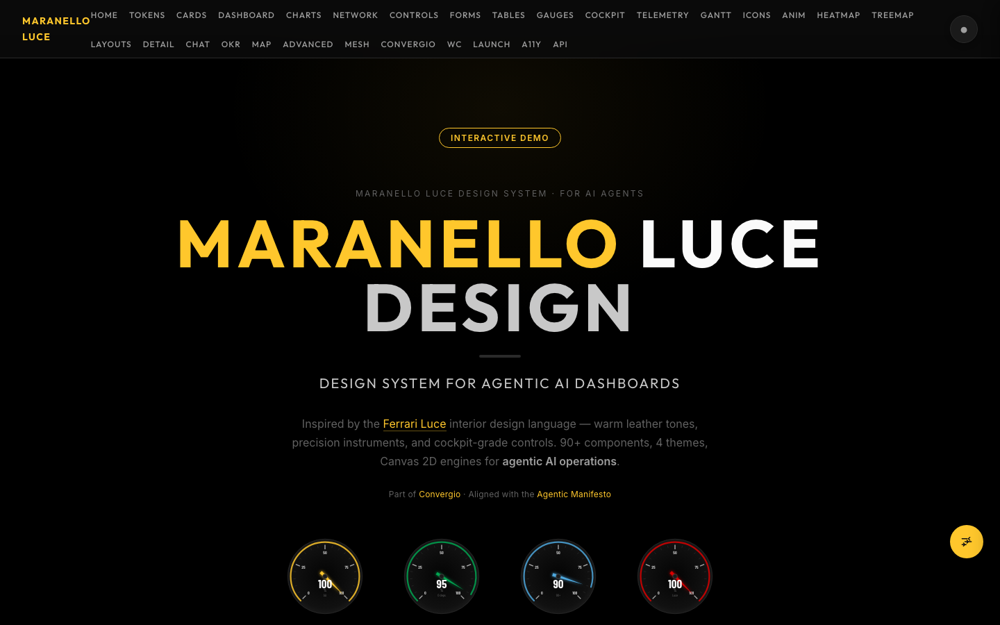
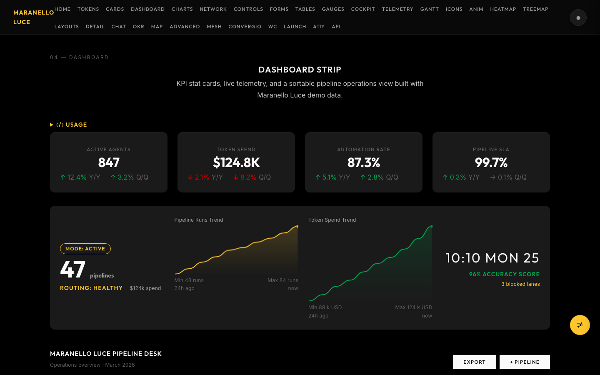
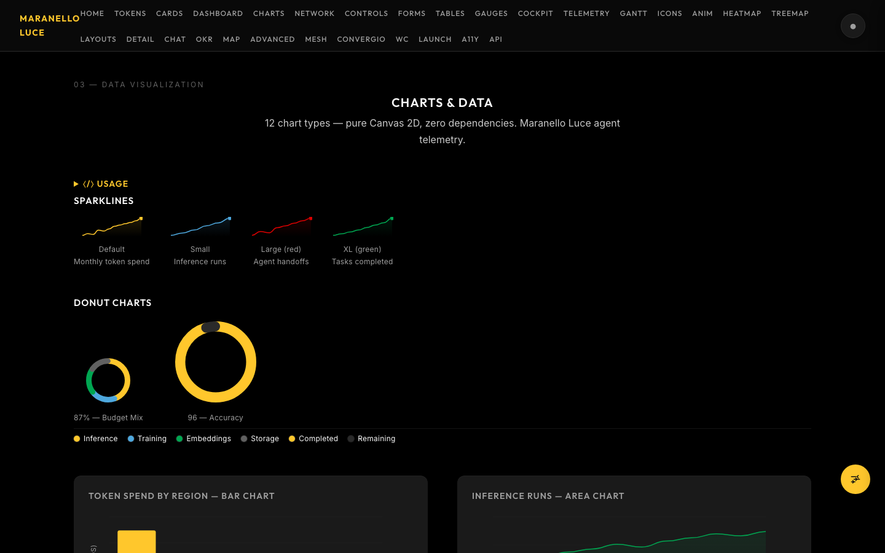
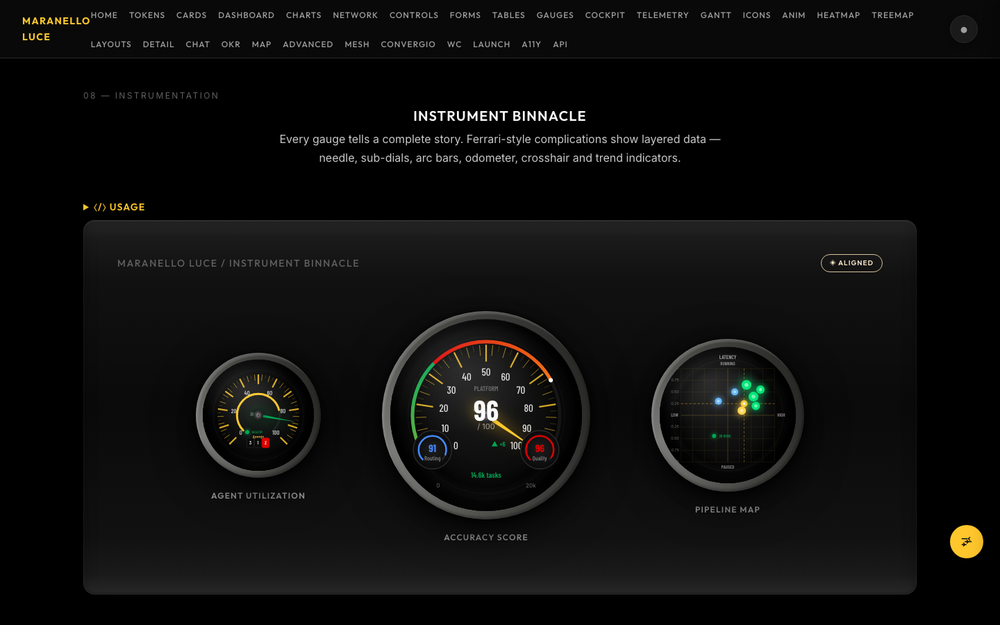
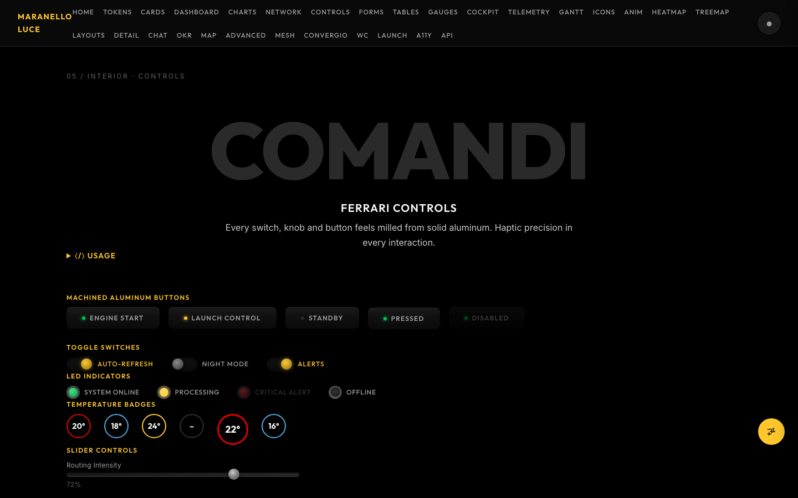
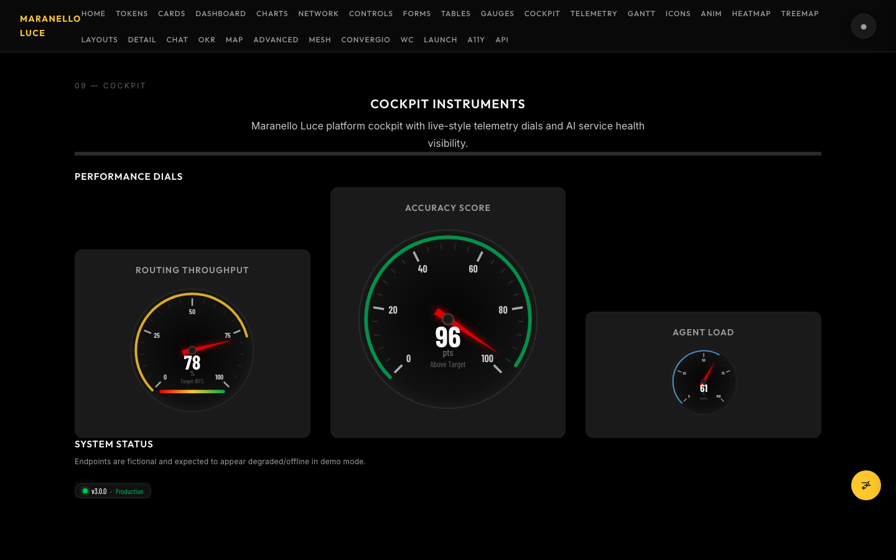
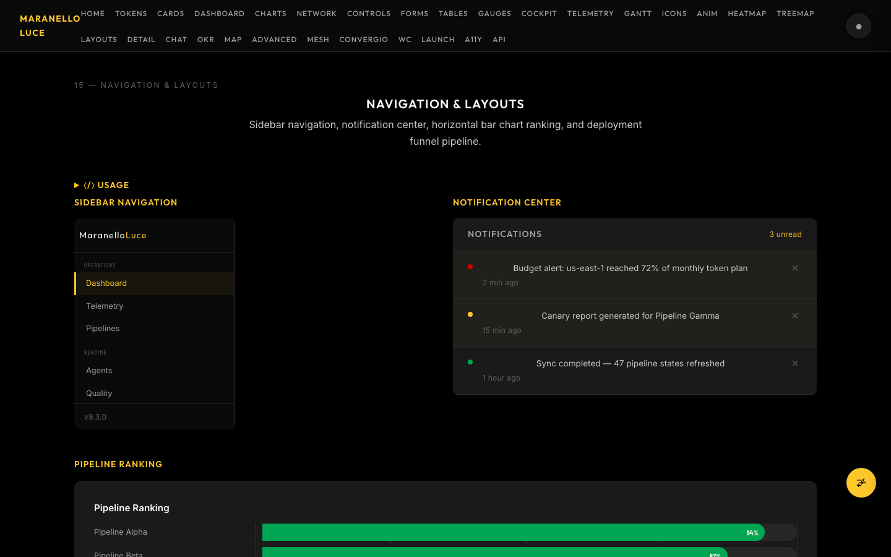
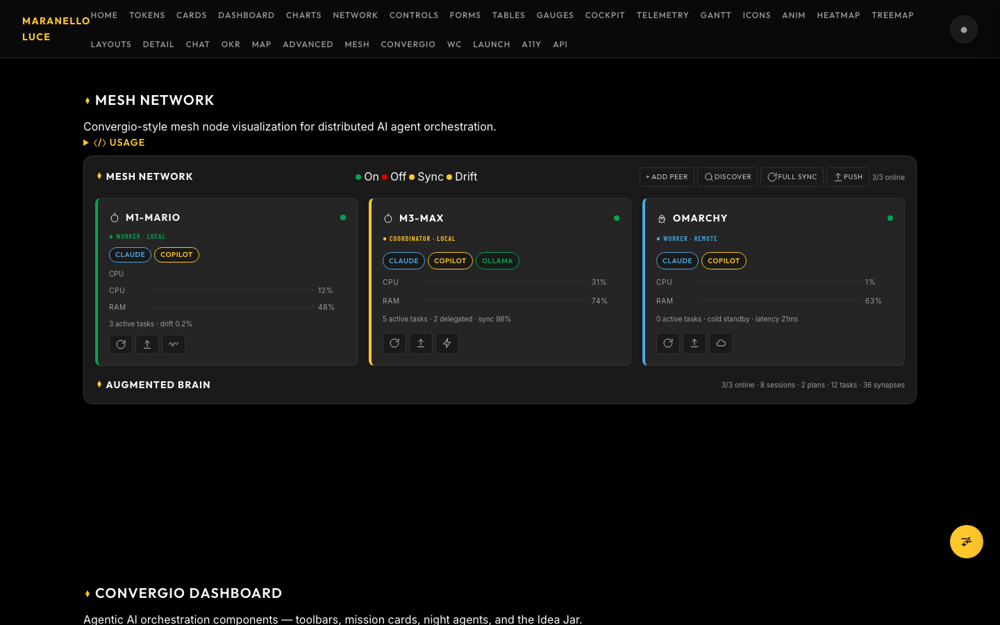
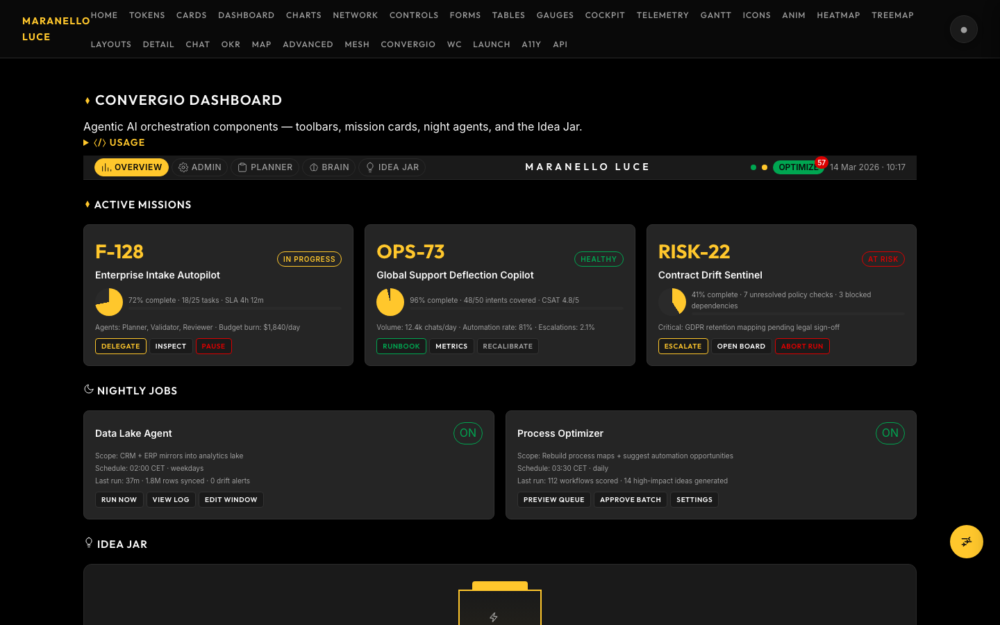

# 🏎️ Maranello Luce Design System

<p align="center">
  
</p>

<p align="center">
  <a href="https://roberdan.github.io/MaranelloLuceDesign/">
    
  </a>
</p>

<p align="center">
  <strong>Ferrari Luce-inspired design system for AI agent dashboards.</strong><br>
  Inspired by <a href="https://www.ferrari.com/it-IT/auto/ferrari-luce">Ferrari Luce</a>. Part of <a href="https://github.com/Roberdan/MyConvergio">Convergio</a>. Aligned with the <a href="https://github.com/Roberdan/MyConvergio/blob/master/AgenticManifesto.md">Agentic Manifesto</a>.
</p>

<p align="center">
  <a href="https://roberdan.github.io/MaranelloLuceDesign/"></a>
</p>

<p align="center">
  
  
  
  
  
  
  
  
</p>

---

> **[▶ Open Full Interactive Demo](https://roberdan.github.io/MaranelloLuceDesign/)** — 30+ sections, every component, 4 themes, self-documenting API snippets · 🇬🇧 EN / 🇮🇹 IT language selector included

---

## Dashboard & KPI Cards



## Charts & Data Visualization



## Ferrari Instrument Binnacle



## Cockpit Controls





## Layouts & Pipeline Funnel



## Mesh Network — AI Agent Orchestration



## Convergio Dashboard — Missions & Ideas



---

## Install

```bash
npm install github:Roberdan/MaranelloLuceDesign#v4.0.2
```

Or CDN:
```html
<link rel="stylesheet" href="https://cdn.jsdelivr.net/gh/Roberdan/MaranelloLuceDesign@v4.0.2/dist/css/index.css">
<script src="https://cdn.jsdelivr.net/gh/Roberdan/MaranelloLuceDesign@v4.0.2/dist/iife/maranello.min.js"></script>
```

> **Breaking change (v4.0.0):** Glass theme removed. Themes are now **editorial · nero · avorio · colorblind**. See [CHANGELOG.md](CHANGELOG.md).

> **New in v4.0.0:** `Maranello.palette()` — reads all 20 semantic color tokens live from the active theme, no caching. Use it inside render functions instead of capturing CSS vars at load time.

## NaSra — Built-in AI Design System Expert

Maranello ships with **NaSra**, an AI agent that knows every token, theme, WCAG rule, and
responsive pattern. She prevents regressions and guides correct usage across all 4 themes.

**In this repo (Claude Code) — auto-loads:**
```
@NaSra what token should I use for a dashboard data label?
@NaSra is this component responsive? does it work on Avorio?
@NaSra check this component for WCAG 2.2 AA compliance
```

**In your project — one line in `CLAUDE.md`:**
```
@node_modules/maranello-luce-design-business/.github/agents/NaSra.agent.md
```

NaSra covers: adaptive token rules · all 4 themes · WCAG 2.2 AA · color blindness prevention ·
responsive checklist · CI constitution. Full guide: [`.github/agents/README.md`](.github/agents/README.md)

## For AI Agents → [AGENT.md](AGENT.md)

## Rules & Governance → [CONSTITUTION.md](CONSTITUTION.md)

## Development

```bash
npm run build && npm run test:unit && npm run dev
```

## Sponsor ❤️

[🫶 Donate to Fightthestroke](https://www.fightthestroke.org/donorbox)

## License

[MPL-2.0](LICENSE) — (c) Roberdan 2026 — Roberto D'Angelo
